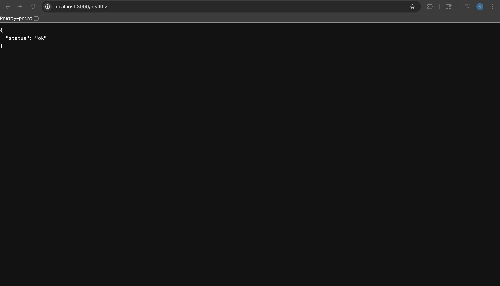
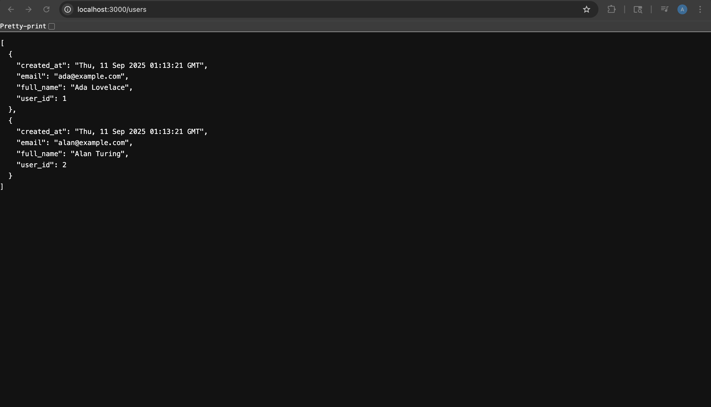
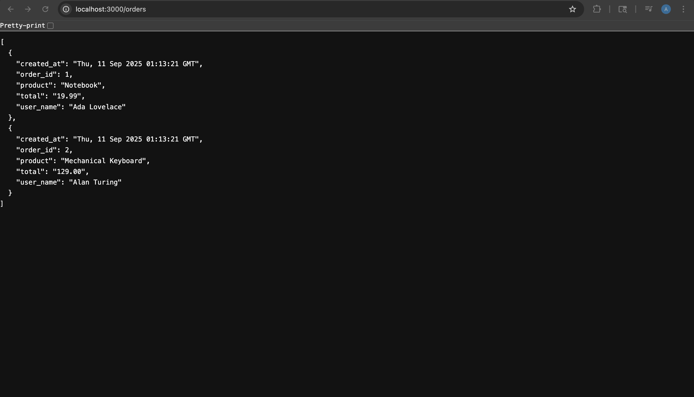

# TakeHomeAssessementAuros_ACLLayer

A simple **DevOps/Cloud-native demo project** showing how to run a Flask API backed by PostgreSQL on a **local Kubernetes cluster (k3d)**.  
The project demonstrates containerization, Helm deployments, service discovery, and port-forwarding to test APIs locally.

---

## 📂 Project Structure

```
.
├─ README.md                       # Setup & usage guide (this file)
├─ api/
│  ├─ app.py                       # Flask API serving endpoints defined by config/mappings.yml
│  ├─ requirements.txt             # Python dependencies
│  └─ Dockerfile                   # Dockerfile to build API image
├─ config/
│  └─ mappings.yml                 # Config-as-code: endpoints → SQL → column mappings
├─ db/
│  └─ init.sql                     # Initializes schema and seeds sample users + orders
├─ helm/
│  ├─ api/                         # Helm chart for API deployment
│  └─ postgres/                    # Helm chart for Postgres deployment
├─ scripts/
│  ├─ setup.sh                     # Creates k3d cluster + local registry
│  ├─ build_and_push.sh            # Builds & pushes API image
│  ├─ deploy.sh                    # Helm upgrade for API + Postgres
│  └─ gitops.sh                    # Optional GitOps demo loop
└─ docs/
   └─ assets/                      # Screenshots & execution artifacts
```

---

## 🚀 How to Run (Step by Step)

### 1. Install prerequisites
- Install **Docker Desktop** → open it and wait until it says **Running**.
- Install tools via Homebrew:
  ```bash
  brew install k3d kubectl helm
  ```

### 2. Create cluster + local registry
```bash
chmod +x scripts/*.sh
./scripts/setup.sh
```
This spins up a k3d cluster (`acl`) with a local Docker registry (`localhost:5001` or `5002`).

### 3. Build & push API image
```bash
./scripts/build_and_push.sh
```
Builds the Flask API image and pushes it to the local registry.

### 4. Import image into k3d nodes & deploy API
```bash
docker tag localhost:5002/acl-api:latest acl-api:latest
k3d image import acl-api:latest -c acl

helm upgrade --install api ./helm/api   -f helm/api/values.yaml   --set image.repository=acl-api   --set image.tag=latest   --set-file mappingYaml=./config/mappings.yml
```

### 5. Deploy Postgres
```bash
helm upgrade --install postgres ./helm/postgres   -f ./helm/postgres/values.yaml   --set-file initSql=./db/init.sql
```

### 6. Port-forward API service
If port 3000 is busy:
```bash
lsof -i :3000
kill -9 <PID>
```

Then:
```bash
kubectl port-forward svc/api-service 3000:3000
```

### 7. Test endpoints
In another terminal:
```bash
curl -s http://localhost:3000/healthz
curl -s http://localhost:3000/users | jq
curl -s http://localhost:3000/orders | jq
```

Expected:
- `/healthz` → `{"status":"ok"}`
- `/users` → JSON array of seeded users
- `/orders` → JSON array of orders joined with users

---

## 🛠 Troubleshooting

- **“Cannot connect to Docker daemon”** → Start Docker Desktop and retry.  
- **ImagePullBackOff** → Re-import the image:
  ```bash
  docker tag localhost:5002/acl-api:latest acl-api:latest
  k3d image import acl-api:latest -c acl
  ```
- **Port 3000 already in use** → Kill the process (`lsof -i :3000` → `kill -9 <PID>`).  

---

## 📊 Execution Results

Artifacts saved in `docs/assets/`:

- [k8s-nodes.txt](docs/assets/k8s-nodes.txt) – Cluster nodes  
- [k8s-pods-running.txt](docs/assets/k8s-pods-running.txt) – Running pods  
- [k8s-svc.txt](docs/assets/k8s-svc.txt) – Services  
- [api-logs.txt](docs/assets/api-logs.txt) – API logs  
- [postgres-logs.txt](docs/assets/postgres-logs.txt) – Postgres logs  
- [healthz.json](docs/assets/healthz.json) – `/healthz` response  
- [users-endpoint.json](docs/assets/users-endpoint.json) – `/users` response  
- [orders-endpoint.json](docs/assets/orders-endpoint.json) – `/orders` response  

### Screenshots
Add your screenshots (saved in `docs/assets/`) like this:

```md
#### Healthz endpoint


#### Users endpoint


#### Orders endpoint

```

---

## 📘 What this project shows

- **Containerization** – Flask API and Postgres as Docker containers.  
- **Local Kubernetes orchestration** – k3d simulates a cluster with registry.  
- **Helm charts** – API and Postgres deployments via reusable charts.  
- **Service discovery** – API connects to Postgres through `postgres-service`.  
- **Port-forwarding & testing** – Expose services locally and test endpoints.  

---

✨ With these steps, anyone can run the project locally and see live API responses.
